# Descripción General de la Página

Página web de e-commerce sobre una página de venta de instrumentos y accesorios, que contiene una página de inicio el catálogo de compras, así como opción para ver el producto en una ventana por separado y añadirlo al carrito.

## Diagrama de Base de datos

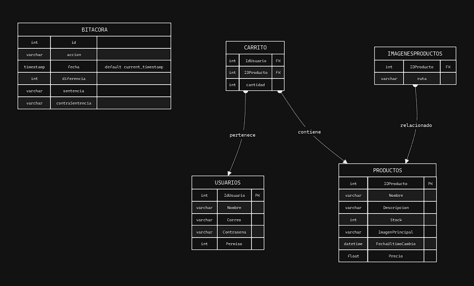

## Pagina inicio
 
En la página de inicio es donde todos los usuarios comenzaran su visita a la página web, esta contiene imágenes representativas de lo que es el e-commerce así como su nombre y logo y su misión y visión dentro del negocio, así como también se puede observar el menú de opciones y el footer de la página.

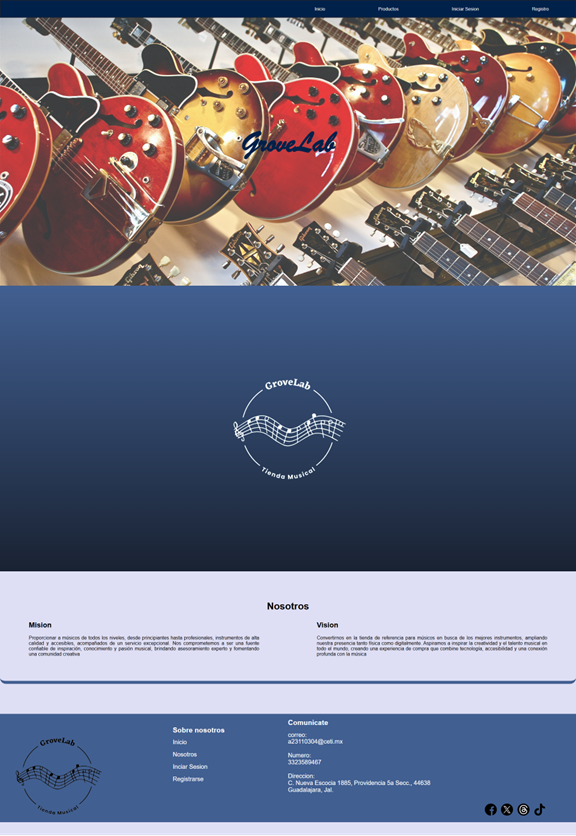

## Registro
 
Esta es la página para poder registrarse, donde se puede observar todos los datos que se necesitan para poder crear un nuevo usuario, también tomando en cuenta que en cuanto se cumpla el registro se iniciara sesión automáticamente.

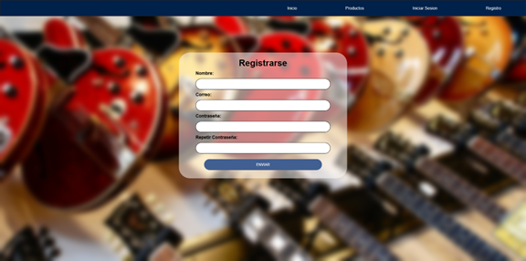

## Inicio de sesión
 
Pagina de inicio de sesión donde ya que el usuario a sido registrado puede iniciar sesión dentro de la pagina para poder empezar a comprar algún producto o accesorio.

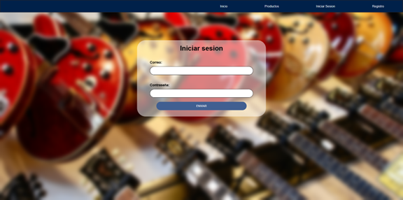

## Productos
 
Pagina donde se listan los instrumentos y accesorios que puedes comprar dentro de la página donde tiene opción para agregar directamente al carrito o al dar click en la tarjeta se abrirá una nueva ventana donde se mostrará la información completa del producto.

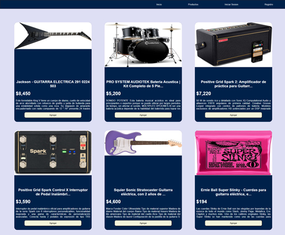

**(con inicio de Sesion)**

 
Al tener la sesión iniciada lo único que cambia dentro de esta ventana es el menú de opciones donde aparece tu nombre y se quitan las opciones para iniciar sesión y registrarse y se agrega la de carrito y la de cerrar sesión, donde además puedes observar la cantidad de objetos que están en tu carrito.

 
## Productos 2.0
 
Al dar click sobre la tarjeta esto es lo que aparecerá en cada uno de los productos donde se muestran más imágenes del producto, el nombre completo del producto si es que no se podía observar dentro de la pagina principal de productos, y su descripción igual completa.

## Carrito 

**(vista carrito sin productos)**

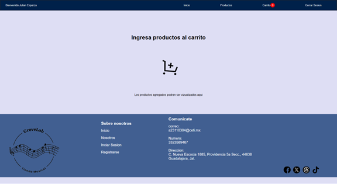

 
**(vista carrito con productos)**

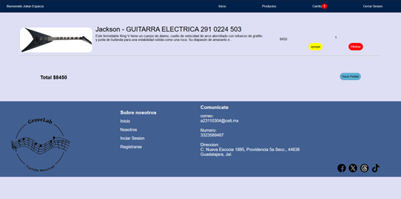

En la vista con productos se puede editar la cantidad de artículos que se van a efectuar o eliminar el producto del carrito, así como hacer el pedido, en este caso el carrito es parte de la base de datos, ya que de esta manera el carrito podrá ser accedido desde cualquier dispositivo y no tendrás que rehacerlo en nuevo dispositivo.

## Inicio administrador 
 
Se listan los productos con toda la información referente a ellos, donde se puede tanto editar cada uno de ellos, eliminar o agregar mas imágenes al área de productos 2.0 

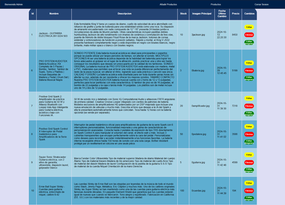

 
**(editar)**

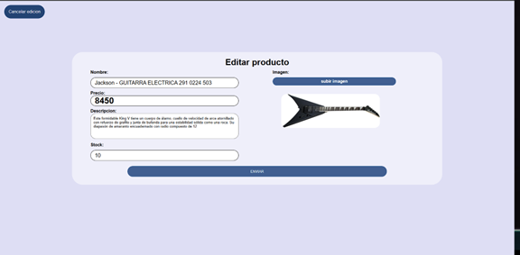

 
**(editar imágenes)**

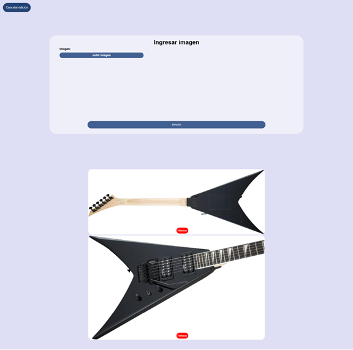

Donde puedes quitar imágenes ya agregadas o agregar más imágenes para la vista de productos 2.0

**Agregar un nuevo producto (vista administrador)**

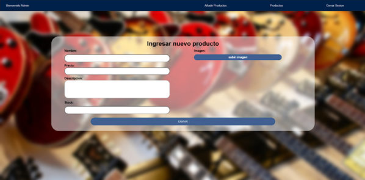

 
Vista para agregar nuevos productos a la base de datos donde en el área de imagen es la imagen principal que aparecerá dentro de la tarjeta de la vista de productos.
